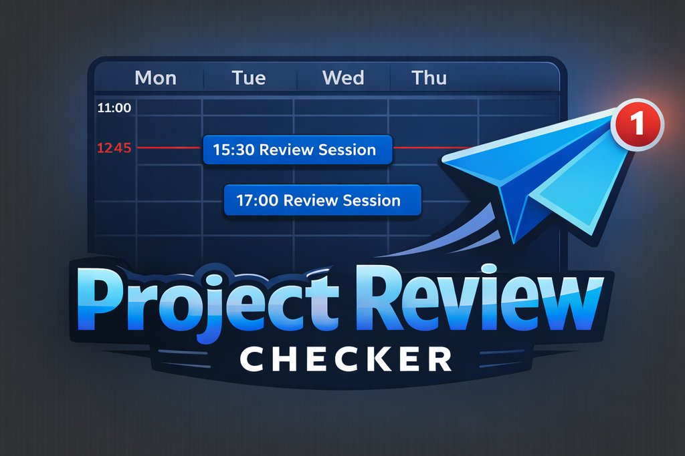

<p align="center">
  
</p>

# School 21 Slot Checker with Telegram Notifications

This pet project automatically monitors the **School 21** educational platform for changes in your evaluation slots.  
If someone registers or cancels a slot assigned to you, the script detects the change and notifies you via a **Telegram bot**.

The tool is designed as an additional helper alongside standard email notifications.

---

## 🚀 Features

- Checks School 21 dashboard for slot changes.
- Detects new registrations and cancellations.
- Sends notifications via Telegram bot.
- Sends initial status after successful start (even if no slots exist).
- Runs inside Docker with ChromeDriver.
- Simple configuration via `config.txt`.

---

## ⚙️ Configuration

Before building the image, **fill in your own settings** in `config.txt`:

```txt
USERNAME=login
PASSWORD=password
PAGE_LOAD_WAIT=15
CHECK_INTERVAL=180
BOT_TOKEN=XXXXXXXX:YYYYYYYYYYYYYYYY
USER_ID=123456789
````

### Parameters

* `USERNAME` – platform login
* `PASSWORD` – platform password
* `CHECK_INTERVAL` – check frequency in seconds
* `PAGE_LOAD_WAIT` – dashboard load wait time (15 is optimal)

**Telegram:**

* `BOT_TOKEN` – token from `@BotFather` (send `/start` to your bot)
* `USER_ID` – your chat id (can be obtained via `@userinfobot`)

⚠️ Settings must be configured **before building the Docker image**.

---

## 🐳 Docker Setup

### Install Docker on Ubuntu

```bash
sudo apt update && sudo apt install docker.io -y
```

---

### Build Image

```bash
sudo docker build -t tg-check .
```

(Without `sudo` on Windows or if Docker is configured for non-root usage.)

---

### Run Script

```bash
sudo docker run tg-check
```

---

### Stop Script

Press:

```text
Ctrl + C
```

---

### Rebuild Rules

Rebuild is required **only if configuration has changed**.

---

## 📬 Notification Logic

* After a successful start, the script **always sends a Telegram message** with current slot status (even if no slots exist).
* After that, notifications are sent **only when changes occur**.

---

## ⚠️ Limitations

* The bot does **not support accounts with 2FA login** (usually volunteer accounts).
* This script is only a **supplementary tool** to standard email notifications.
* Do **not rely solely on this script** for critical checks.
* The author is **not responsible for missed reviews caused by script malfunction**.

---

## 🛠 Purpose

This project is intended as a small automation helper for School 21 mentors and reviewers who want faster slot updates via Telegram.

---

Good luck and happy reviewing 🚀
